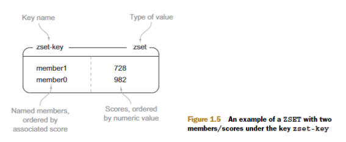
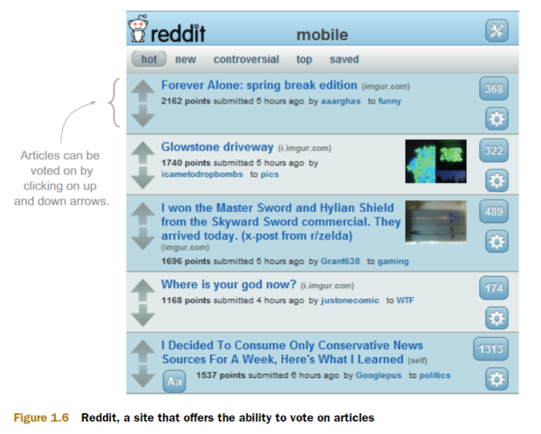

# Setup
1. Create Redis instance using podman
```shell
podman run --name redis-in-action -p 6379:6379 -d redis 
# output sth like: 7e3c195ab6b91e0ac26c27380ecc4b21312fb69447d2ae91c30a875294ff7ed8
```

2. Enter Redis
```shell
podman exec -it redis-in-action sh

# Prompt to inside redis then type
redis-cli

# Now you can access to redis
127.0.0.1:6379>
```
# Redis Introduction
## Data type
### String


Commands:
```shell
GET # Fetches the data stored at the given key value stored at the given key (works for all types
SET # Sets the value stored at the given key 
DEL # Deletes the value stored at the given key (works for all types)
```
### Lists


Commands

```shell
RPUSH # Pushes the value onto the right end of the list 
LRANGE # Fetches a range of values from the list 
LINDEX # Fetches an item at a given position in the list 
LPOP # Pops the value from the left end of the list and returns it
```
### Sets


Commands

```shell
SADD # Adds the item to the set 
SMEMBERS # Returns the entire set of items 
SISMEMBER # Checks if an item is in the set 
SREM # Removes the item from the set, if it exists
```
### Hashes


Commands

```shell
HSET # Stores the value at the key in the hash 
HGET # Fetches the value at the given hash key 
HGETALL # Fetches the entire hash 
HDEL # Removes a key from the hash, if it exist
```
### Sorted sets


Commands

```shell
ZADD # Adds member with the given score to the ZSET 
ZRANGE # Fetches the items in the ZSET from their positions in sorted order 
ZRANGEBYSCORE # Fetches items in the ZSET based on a range of scores 
ZREM # Removes the item from the ZSET, if it exists
```

## Problem
 In recent years, a growing number of sites have offered the ability to **vote** on:
 - web page links 
 - articles
 - or questions 
 
including sites such as reddit and Stack Overflow, as shown like below.

By taking into consideration the votes that were cast, posts are ranked and displayed based on a score relating those votes and when the link was submitted. We’ll build a Redis-based back end for a simple version of this kind of site.